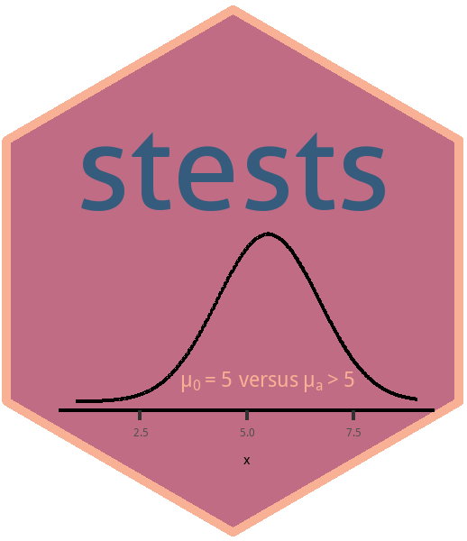

<!-- badges: start -->
[](https://github.com/fhernanb/stests/actions/workflows/R-CMD-check.yaml)
<!-- badges: end -->

# stests 

An R package with useful functions to perform several statistical tests.

You can visit the [package website](https://fhernanb.github.io/stests/index.html) to explore the vignettes (articles) and function reference. 

### Installation

* Install latest development version from GitHub using the code given below:

```r
if (!require("devtools")) install.packages("devtools")
devtools::install_github("fhernanb/stests", force=TRUE)
```

